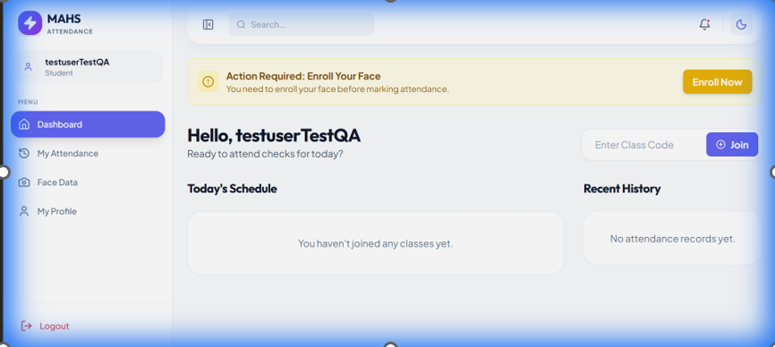
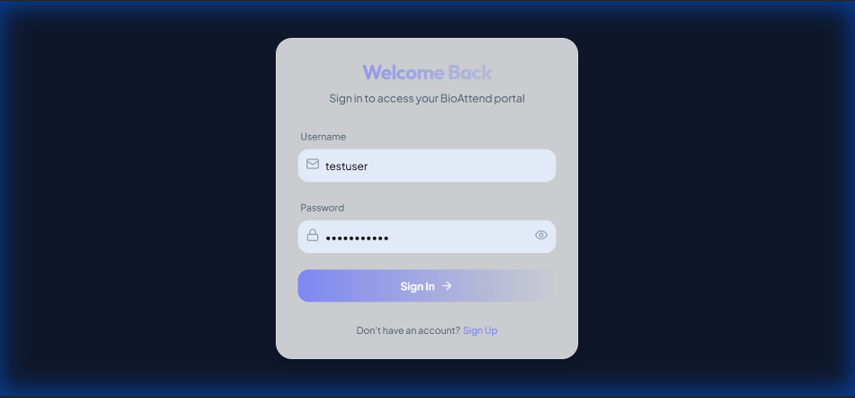
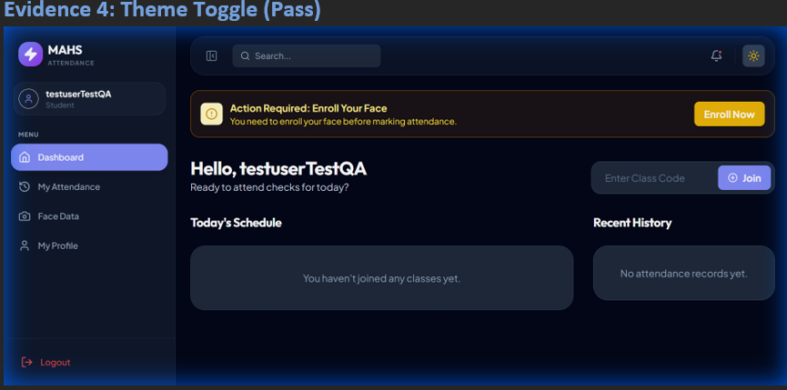
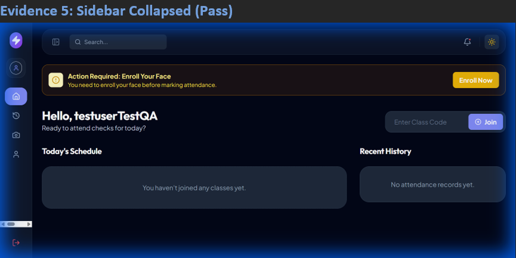

<div align="center">

  <h1 style="font-size: 3rem; font-weight: bold; background: -webkit-linear-gradient(45deg, #6366f1, #ec4899); -webkit-background-clip: text; -webkit-text-fill-color: transparent;">
    Biometric Attendance System
  </h1>

  <h3 style="color: #6b7280; font-family: 'Inter', sans-serif;">
    College of Technology and Built Environment
  </h3>
  
  <p style="font-size: 1.1rem; color: #4b5563;">
    <strong>Advisor:</strong> Ms. Nuniyat Kifle &nbsp;|&nbsp; <strong>Date:</strong> January 2026
  </p>

  <p>
    <a href="#features">Features</a> •
    <a href="#team-members">Team</a> •
    <a href="#tech-stack">Tech Stack</a> •
    <a href="#setup">Setup</a>
  </p>

  <br />

  
  
  

</div>

<br />

---

## 📖 **Project Overview**

The **Biometric Attendance System** is a state-of-the-art solution designed to modernize educational attendance tracking. Developed by **Section 2 students** for the College of Technology and Built Environment, this project leverages **Artificial Intelligence** to authenticate students via facial recognition, ensuring **100% accuracy** and eliminating proxy attendance.

### 🏆 **Why This Project Stands Out**
*   **Zero Proxy Tolerance**: Utilizes advanced geometric facial mapping to prevent fraudulent attendance.
*   **Paperless Campus**: significantly reduces paper waste, contributing to a greener environment.
*   **Time Efficiency**: Marks attendance for an entire class in a fraction of the time compared to manual roll calls.
*   **Live Analytics**: Provides real-time insights into student attendance patterns for better academic interventions.

---

## 👥 **Team Members**


| No. | Name | ID Number | Role |
| :--- | :--- | :--- | :--- |
| 1. | **Abraham Nigatu** | UGR/7532/16 | *Developer* |
| 2. | **Hermela Teklegebriel** | UGR/5174/16 | *Figma Designer* |
| 3. | **Manuhe Habtamu** | UGR/2808/16 | *Developer* |
| 4. | **Naomi Mesfin** | UGR/8207/16 | *Developer* |
| 5. | **Tsedeniya Fiseha** | UGR/9263/16 | *Figma Designer* |
| 6. | **Yordanos Teshome** | UGR/0489/16 | *Developer* |
| 7. | **Zenebu Melaku** | UGR/6058/16 | *Figma Designer* |

> **Credit:** Special thanks to **Kaleab "the Gooner" Mulugeta** for the architectural guidance.

---

## 🌟 **Key Features**

*   **🤖 AI-Powered Facial Recognition**: Seamless, contact-less attendance using OpenCV and dlib.
*   **🛡️ Liveness Detection**: (Planned/Pro) Prevents spoofing using photos or videos.
*   **⚡ Real-Time Dashboard**: Instant feedback for students and admins.
*   **📊 Automated Reporting**: Generates weekly/monthly PDF & Excel reports automatically.
*   **🎨 Dynamic UI/UX**: A responsive, dark-mode enabled interface built with React & Framer Motion.
*   **🔐 Role-Based Access Control**: Secure login for Admins, Teachers, and Students.

---

## 🏗️ **System Architecture**

The system follows a modern **Client-Server Architecture**:

1.  **Frontend (Client)**: React.js application captures video feed and handles user interaction.
2.  **API Layer**: RESTful endpoints protected by JWT Authentication transfer data securely.
3.  **Backend (Server)**: Django processes images, runs facial recognition algorithms, and manages the SQLite/PostgreSQL database.
4.  **Database**: Stores user profiles, hashed face encodings, and attendance logs.

---

## 🛠️ **Tech Stack**

<details open>
<summary><strong>🖥️ Frontend</strong></summary>
<br />

| Tech | Description |
| :--- | :--- |
|  | Dynamic UI Rendering |
|  | Build Tool |
|  | Modern Styling |

</details>

<details open>
<summary><strong>⚙️ Backend</strong></summary>
<br />

| Tech | Description |
| :--- | :--- |
|  | API & Verification Logic |
|  | Image Processing |
|  | Data Analysis |

</details>

---

## 🚀 **Getting Started** <a id="setup"></a>

### **Prerequisites**
*   **Node.js** (v18+)
*   **Python** (v3.10+)

📦 Deployment Status
The system has not been deployed to the cloud yet due to the requirement for paid features in cloud services (e.g., hosting, database scaling, and AI model serving). We plan to deploy it soon once we secure the necessary resources or sponsorships for these paid features.

### ** Installation**

1.  **Clone the Repo**:
    ```bash
    git clone https://github.com/your-username/biometric-attendance-system.git
    cd biometric-attendance-system
    ```

2.  **Backend Setup**:
    ```bash
    cd backend
    python -m venv venv
    # Activate: venv\Scripts\activate (Win) or source venv/bin/activate (Mac/Linux)
    pip install -r requirements.txt
    python manage.py runserver
    ```

3.  **Frontend Setup**:
    ```bash
    cd frontend
    npm install
    npm run dev
    ```

---

## 📸 **Screenshots**

| **Dashboard (Light)** | **Login Page** |
|:---:|:---:|
|  |  |

| **Dashboard (Dark)** | **Sidebar Collapsed** |
|:---:|:---:|
|  |  |

---


